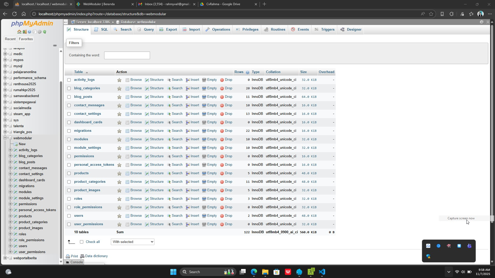
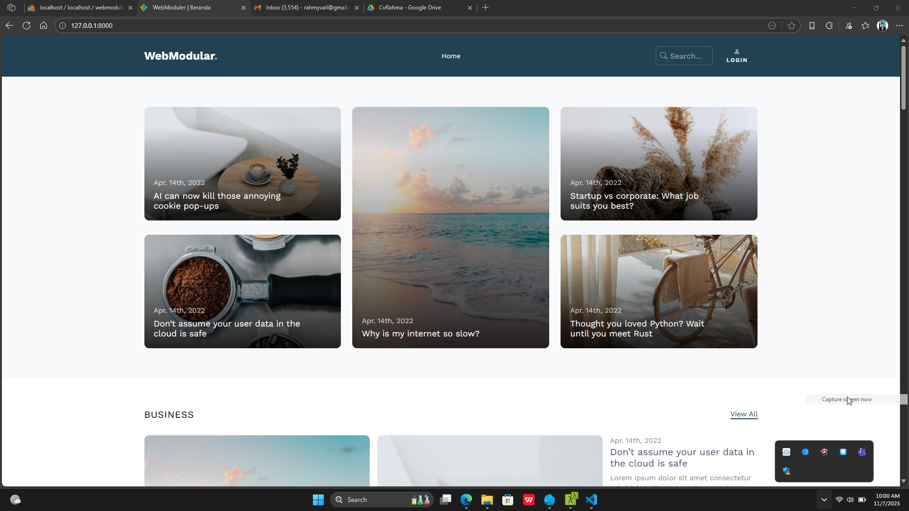
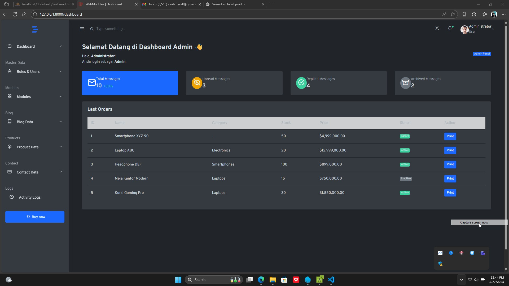
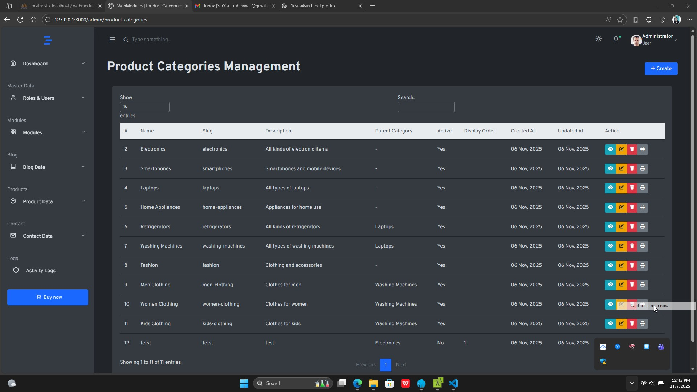
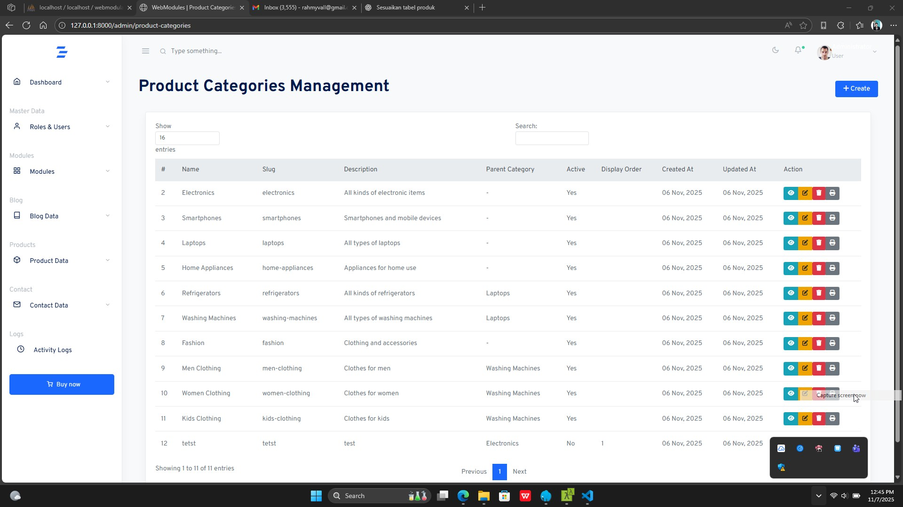
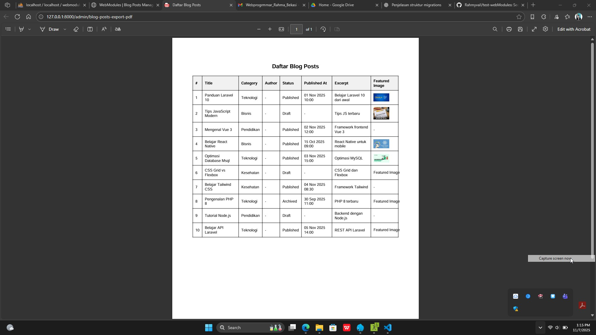

## Fontend & Backend

## About Laravel

Ini penjelasan singkat:

Roles & Permissions: roles, permissions, role_permissions, users, user_permissions → untuk manajemen hak akses.

Modules & Settings: modules, module_settings → menyimpan modul dan pengaturannya.

Blog: blog_categories, blog_posts → kategori dan konten artikel.

Products: product_categories, products, product_images → kategori produk, data produk, dan gambarnya.

Contact: contact_messages, contact_settings → pesan dari pengguna dan pengaturan kontak.

Activity Logs: activity_logs → catatan aktivitas pengguna di sistem.

